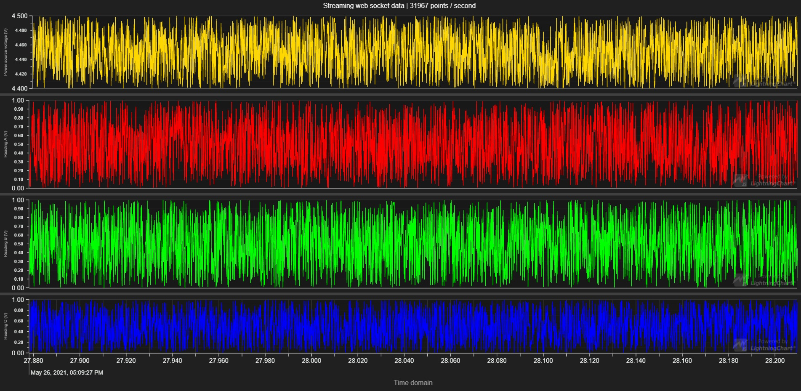

# Websocket real-time data visualization using LightningChart JS

Super compact test application of visualizing real-time data stream in a scrolling line chart with multiple channels.

A **single** `HTML` file - no build or external content script required...

... creates **this** chart:



Chart is rendered with [LightningChart JS](https://www.arction.com/lightningchart-js/).

The data is generated in a `Node.js` server and streamed with `WebSocket` to the client. WebSocket is really powerful for real-time data transferring - with my PC I easily streamed **300 000** data points every second and rendered it with `LCJS` with stable 60 FPS.

This could also be optimized even further by using more efficient data formats (I used `JSON` strings for simplicity).

## Try it yourself

^ `nodemon` and `live-server` are used for hot-reload and hosting client/server.

1. Install `Node.js`

2. Start test server

```bash
cd server
npm i
npm i --global nodemon
nodemon index.js
```

3. Start client

```bash
cd client
npm i --global live-server
live-server
```

Client can be viewed by opening browser at `URL`: _localhost:8080_
